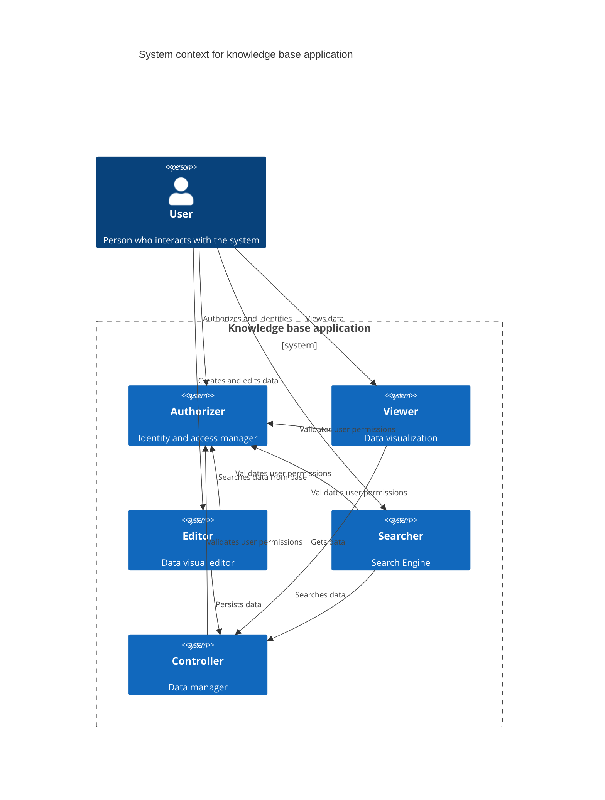

```mermaid
C4Context
    title System context for knowledge base application
    Person(user, "User", "Person who interacts with the system")
    Boundary(plain, "Knowledge base application") {
        System(authorizer, "Authorizer","Identity and access manager")
        System(viewer, "Viewer", "Data visualization")
        System(editor, "Editor", "Data visual editor")
        System(searcher, "Searcher", "Search Engine")
        System(controller, "Controller", "Data manager")
    }

    Rel(user, viewer, "Views data")
    Rel(user, authorizer, "Authorizes and identifies")
    Rel(user, editor, "Creates and edits data")
    Rel(user, searcher, "Searches data from base")

    Rel(viewer, authorizer, "Validates user permissions")
    Rel(viewer, controller, "Gets data")

    Rel(editor, authorizer, "Validates user permissions")
    Rel(editor, controller, "Persists data")

    Rel(searcher, authorizer, "Validates user permissions")
    Rel(searcher, controller, "Searches data")

    Rel(controller, authorizer, "Validates user permissions")

    UpdateRelStyle(editor, authorizer, $offsetY="-10", $offsetX="30")
    UpdateRelStyle(user, searcher, $offsetY="150", $offsetX="-130")
    UpdateRelStyle(searcher, authorizer, $offsetY="20", $offsetX="10")
    UpdateRelStyle(searcher, controller, $offsetY="-20", $offsetX="-40")
    UpdateLayoutConfig($c4ShapeInRow="3", $c4BoundaryInRow="1")
```
